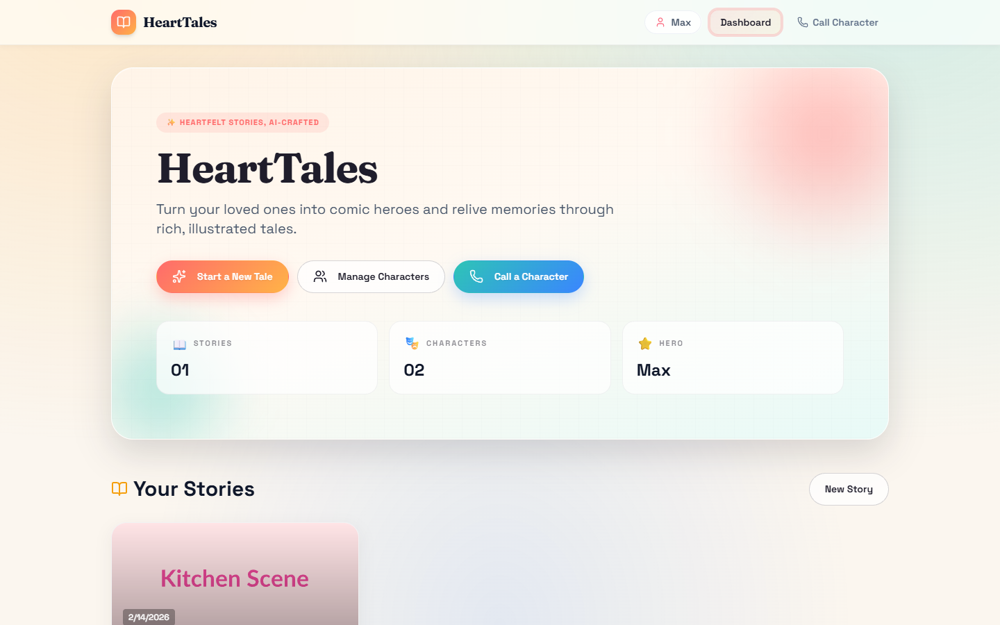
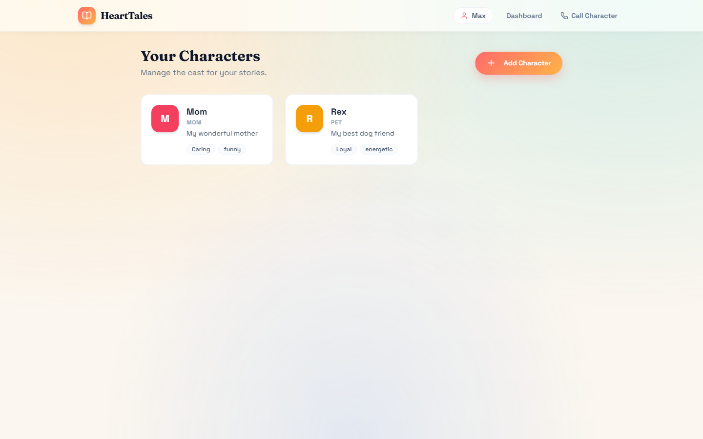
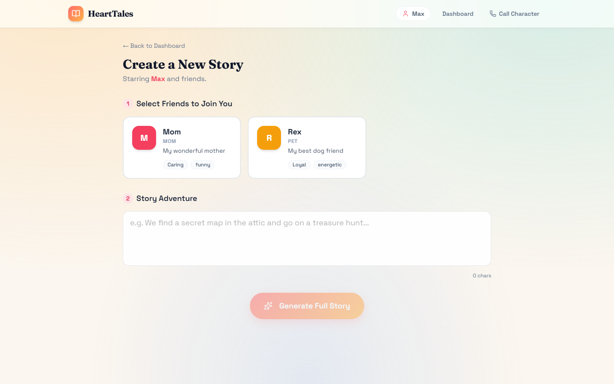
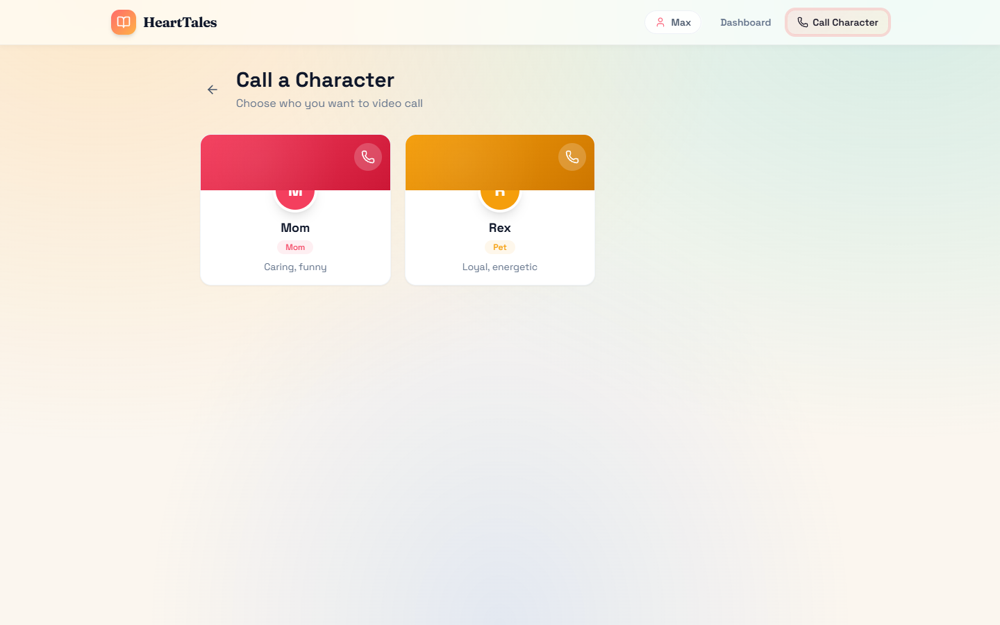
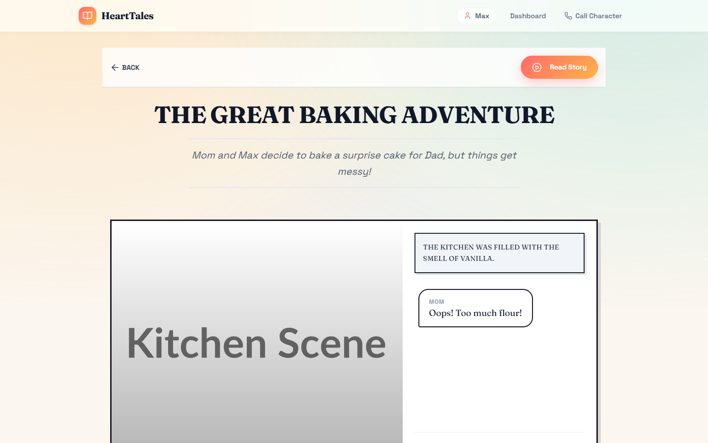

# HeartTales - Turn memories into animated stories

> **Turn your loved ones into characters in AI-generated comic stories — with illustrations, voice narration, and real-time character calls.**

HeartTales is a browser-based storytelling platform that lets you create personalized characters (family, friends, pets) and generate short comic stories featuring them. Every story comes with manga-style illustrations and voice narration — all powered by Google Gemini. You can even "call" your characters and have a live conversation with their AI-driven personalities.

---

## 📖 Table of Contents

- [What Does It Do?](#-what-does-it-do)
- [Key Features](#-key-features)
- [Tech Stack](#-tech-stack)
- [How It Works Under the Hood](#-how-it-works-under-the-hood)
- [Project Structure](#-project-structure)
- [Getting Started](#-getting-started)
- [Environment Variables](#-environment-variables)
- [Benefits](#-benefits)
- [Team](#-team)
- [License](#-license)

---

## 🎯 What Does It Do?



HeartTales solves a simple but meaningful problem: **keeping emotional bonds strong with the people you care about**, even when life keeps you apart.

Instead of sending a regular text or making a phone call, you can:

1. **Create characters** based on your real family members or friends (name, personality, relationship)
2. **Write a story idea** like *"Mom and I bake a cake together for Dad's birthday"*
3. **Let AI generate a full comic story** — with scenes, dialogue, illustrations, and voice narration
4. **Call your characters** — have a real-time voice/text conversation with them, as if they're right there

Everything runs directly in your browser with no backend server needed (except an optional Docker container for high-quality TTS).

---

## ✨ Key Features

### 🧑‍🤝‍🧑 Character Management


- Create characters with a **name, gender, relation** (Mom, Friend, Pet, etc.), **personality traits**, and a **description**
- Assign unique **avatar colors** and **voice presets** (Puck, Charon, Kore, Fenrir, Zephyr)
- Edit or delete characters anytime — they persist in your browser's localStorage

### 👤 User Profile (Protagonist)
- Set up your own profile as the **main protagonist** of every story
- Your name, gender, description, and voice preset are saved and reused across stories

### 📝 Story Creation


- Pick any number of your saved characters
- Describe a story idea in plain text
- AI generates a structured **3-scene comic story** with a title, synopsis, narration, and dialogues

### 🎨 Manga-Style Scene Illustrations
- Each scene gets an AI-generated **manga-style illustration** (black & white, dramatic lighting, high-quality line art)
- Images are generated in **16:9 aspect ratio** for a cinematic comic feel
- If an image fails to generate, the story still works — it handles errors gracefully

### 🔊 Voice Narration & Dialogue
- Every line of dialogue can be **spoken aloud** using text-to-speech
- Two TTS options:
  - **Coqui XTTS** (via Docker) — high-quality, neural voice cloning
  - **Browser SpeechSynthesis** — fallback that works out of the box, no setup needed

### 📞 Character Call (Voice & Text Chat)


- Start a **video-call-style conversation** with any character
- The character stays **fully in-character** based on their personality traits and relationship to you
- Supports both:
  - **Text chat** — type messages and get responses
  - **Voice input** — speak using your microphone (browser Speech Recognition), and the character replies with synthesized voice
- Includes a 3D animated avatar with speaking animations and call timer

### 📚 Story Dashboard
- View all your created stories in a card layout
- Each card shows the **title, synopsis, creation date**, and **character avatars**
- Click any card to open the full story viewer

### 📖 Story Viewer


- Comic-panel layout with narration and dialogue bubbles
- Play individual lines of dialogue or read the whole story
- Auto-scrolls through scenes during playback

### 💾 Local Persistence
- Everything is stored in **localStorage** — characters, stories, and your profile
- No account or server required — your data stays on your device

---

## 🛠️ Tech Stack

| Layer | Technology | Purpose |
|-------|-----------|---------|
| **Frontend Framework** | React 19 + TypeScript | Component-based UI with type safety |
| **Build Tool** | Vite 6 | Lightning-fast dev server and optimized production builds |
| **Styling** | Tailwind CSS (via CDN) | Utility-first CSS for rapid, responsive UI development |
| **Typography** | Google Fonts (Inter, Comic Neue) | Clean UI text (Inter) and comic-style text (Comic Neue) |
| **Icons** | Lucide React | Beautiful, consistent SVG icon library |
| **AI — Story Generation** | Google Gemini (`gemini-3-flash-preview`) | Generates structured 3-scene comic stories as JSON |
| **AI — Image Generation** | Google Gemini (`gemini-2.5-flash-image`) | Creates manga-style scene illustrations from text prompts |
| **AI — Character Chat** | Google Gemini (`gemini-2.5-flash`) | Powers the real-time character roleplay conversations |
| **TTS — High Quality** | Coqui XTTS (via Docker) | Neural text-to-speech with voice cloning capabilities |
| **TTS — Fallback** | Browser SpeechSynthesis API | Built-in browser TTS, works without any setup |
| **Voice Input** | Browser SpeechRecognition API | Captures user voice during character calls |
| **Data Storage** | Browser localStorage | Persists characters, stories, and profiles locally |
| **Containerization** | Docker + Docker Compose | Runs the XTTS voice server as a container |

---

## ⚙️ How It Works Under the Hood

### 1. Story Generation Pipeline

```
You write a story idea
        ↓
Gemini 3 Flash Preview generates a structured JSON:
  { title, synopsis, scenes: [{ visual_description, narration, dialogue }] }
        ↓
Each scene's visual_description → Gemini 2.5 Flash Image → manga illustration
        ↓
Each dialogue line → XTTS or Browser TTS → audio narration
        ↓
Everything assembled into a comic-panel story viewer
```

### 2. Character Call Flow

```
You select a character → "Call" starts
        ↓
You speak (microphone) or type a message
        ↓
Browser SpeechRecognition converts your voice → text
        ↓
Text + chat history → Gemini 2.5 Flash (roleplay mode) → character response
        ↓
Response → Browser SpeechSynthesis → character "speaks" back
        ↓
3D avatar animates lip-sync while speaking
```

### 3. Coqui XTTS (Docker TTS)

The `docker-compose.yml` runs the [Coqui XTTS API Server](https://github.com/daswer123/xtts-api-server) for neural text-to-speech:

```yaml
services:
  xtts:
    image: daswer123/xtts-api-server
    ports:
      - "5002:8020"     # Accessible at http://localhost:5002
    volumes:
      - ./xtts-data:/app/tts   # Mount speaker voice samples
    environment:
      - COQUI_TOS_AGREED=1
```

> **Note:** This is optional. If the Docker container isn't running, the app falls back to the browser's built-in SpeechSynthesis API.

---

## 📁 Project Structure

```
storyverse-ai/
├── index.html              # Entry HTML — loads Tailwind CDN, Google Fonts, and React
├── index.tsx               # React DOM render entry point
├── App.tsx                 # Main app component — routing, state management, localStorage
├── types.ts                # TypeScript interfaces (Character, Story, Scene, UserProfile, etc.)
│
├── components/
│   ├── Button.tsx          # Reusable button component with variants
│   ├── CharacterManager.tsx  # Create, edit, and delete characters + user profile setup
│   ├── CharacterCard.tsx   # Individual character display card
│   ├── StoryCreator.tsx    # Story creation form — select characters, enter prompt, generate
│   ├── StoryViewer.tsx     # Comic-panel story reader with audio playback
│   └── CharacterCall.tsx   # Voice/text call UI — 3D avatar, speech recognition, chat
│
├── services/
│   └── geminiService.ts    # All AI integrations — story gen, image gen, TTS, character chat
│
├── docker-compose.yml      # Docker config for Coqui XTTS voice server
├── xtts-data/              # Volume mount for XTTS speaker voice samples
│
├── vite.config.ts          # Vite configuration — env vars, path aliases, dev server
├── tsconfig.json           # TypeScript compiler configuration
├── package.json            # Dependencies and scripts
├── metadata.json           # Project metadata (name, description)
├── .env.local              # Environment variables (API keys — not committed)
└── .gitignore              # Git ignore rules
```

---

## 🚀 Getting Started

### Prerequisites

- **Node.js** (v18 or later)
- **A Google Gemini API key** — [Get one here](https://aistudio.google.com/apikey)
- **Docker** (optional, only needed for high-quality XTTS voice synthesis)

### 1. Clone the Repository

```bash
git clone https://github.com/Jayesh-Kr/StoryVerse.git
cd storyverse-ai
```

### 2. Install Dependencies

```bash
npm install
```

### 3. Set Up Environment Variables

Create a `.env.local` file in the project root:

```env
GEMINI_API_KEY=your_gemini_api_key_here
VITE_TTS_API_URL=http://localhost:5002
```

| Variable | Required | Description |
|----------|----------|-------------|
| `GEMINI_API_KEY` | ✅ Yes | Your Google Gemini API key for story, image, and chat generation |
| `VITE_TTS_API_URL` | ❌ Optional | URL of the Coqui XTTS Docker server (defaults to `http://localhost:5002`) |

### 4. Start the Dev Server

```bash
npm run dev
```

The app will be running at **http://localhost:3000**.

### 5. (Optional) Start the XTTS Voice Server

If you want high-quality neural TTS instead of browser speech synthesis:

```bash
docker compose up -d
```

This pulls and runs the `daswer123/xtts-api-server` image, exposing the TTS API on port **5002**.

---

## 🌍 Benefits

### For Families & Relationships
- **Bridge emotional distance** — create stories featuring your loved ones, no matter how far apart you are
- **Preserve memories** — turn real moments into illustrated comic stories you can revisit anytime
- **Personalized bedtime stories** — generate unique stories starring your kids, complete with illustrations and narration

### For Creativity & Entertainment
- **Zero artistic skill needed** — AI handles the illustrations, writing, and voice acting
- **Infinite story possibilities** — any idea, any characters, any scenario
- **Interactive characters** — actually talk to your story characters through voice calls

### For Education
- **Visual storytelling** — helps children engage with stories through comic-style panels
- **Language practice** — hear stories narrated aloud with AI-generated speech
- **Creative writing aid** — use AI as a co-writer to explore story ideas

### Technical Benefits
- **No backend required** — runs entirely in the browser (except optional Docker TTS)
- **Privacy-first** — all data stays in your browser's localStorage, nothing is sent to external servers (beyond the Gemini API calls)
- **Free to use** — powered by Gemini's free-tier API
- **Lightweight** — minimal dependencies, fast load times, no database setup
- **Offline-friendly storage** — your characters and stories persist even after closing the browser

---

## 👥 Team

| Name | Role |
|------|------|
| **Jayesh** | Full Stack Developer (React, Node.js) |
| **Raushan** | AI/ML Engineer (Story & Image Generation) |
| **Rajan** | UI/UX Designer (Figma, Frontend) |
| **Satvik** | Product Manager (Vision, Presentation) |

---

## 📜 License

This project is licensed under the **MIT License** — see the [LICENSE](LICENSE) file for details.

---

## 🙏 Acknowledgments

- **Google Gemini** — for powering story generation, image creation, and character conversations
- **Coqui TTS / XTTS** — for high-quality open-source text-to-speech
- **Lucide** — for the beautiful icon set
- **Vite** — for the blazing-fast development experience

---

## 📝 Notes

- The app reads `GEMINI_API_KEY` from `.env.local` via Vite's `define` config at build time.
- Audio playback uses the browser's `AudioContext` — some browsers require a user gesture (click/tap) before playing audio.
- The character call feature uses the browser's `SpeechRecognition` API, which works best in **Chromium-based browsers** (Chrome, Edge, Brave).
- If the XTTS Docker container is not running, voice narration in stories will not work, but the character call feature will still use browser TTS as a fallback.
